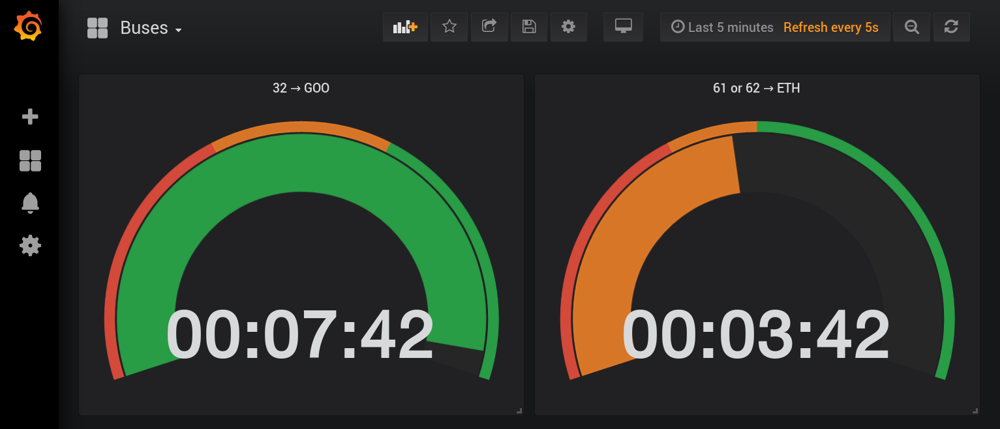

# transport-ch-exporter

Prometheus exporter for the transport.opendata.ch public transport API.

Haven't you always wanted to have a proper dashboard to check your next tram? ;-)



Which connections are checked is configured in `config.yml` (an example is included here).

Once running, use queries such as:
```
min(transport_next_departure_unixtime{number=~"61|62"} - time())
```
